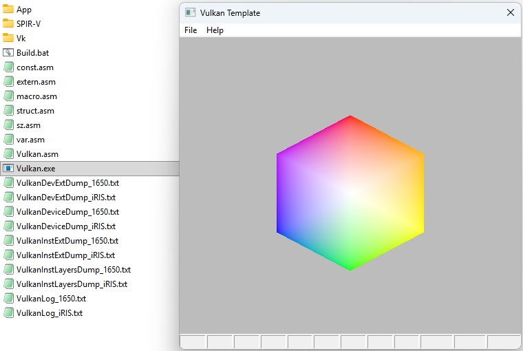

# Vulkan x64 Assembly Demo

A minimal, fully-featured Vulkan application written in **pure x64 assembly** using MASM.  
It creates a window, initializes Vulkan, and renders a colorful hexagon using a triangle fan.

## Features

- Dynamic validation layer discovery and enabling
- Full swapchain and render pass setup
- Custom shader compilation to SPIR-V
- Error logging and debugging

## Requirements

- Windows 10/11
- Visual Studio Build Tools (for ML64)
- Vulkan SDK 1.3+

## Build

@echo off

set AppName=Vulkan
set BinPath=D:\bin\dev\asm\ml64\VS2019\bin

if exist %AppName%.obj del %AppName%.obj
if exist %AppName%.exe del %AppName%.exe

%BinPath%\ml64 /c /Fo %AppName%.obj %AppName%.asm
%BinPath%\link.exe %AppName%.obj /ENTRY:WinMain /SUBSYSTEM:WINDOWS

del %AppName%.obj

dir %AppName%.*

pause